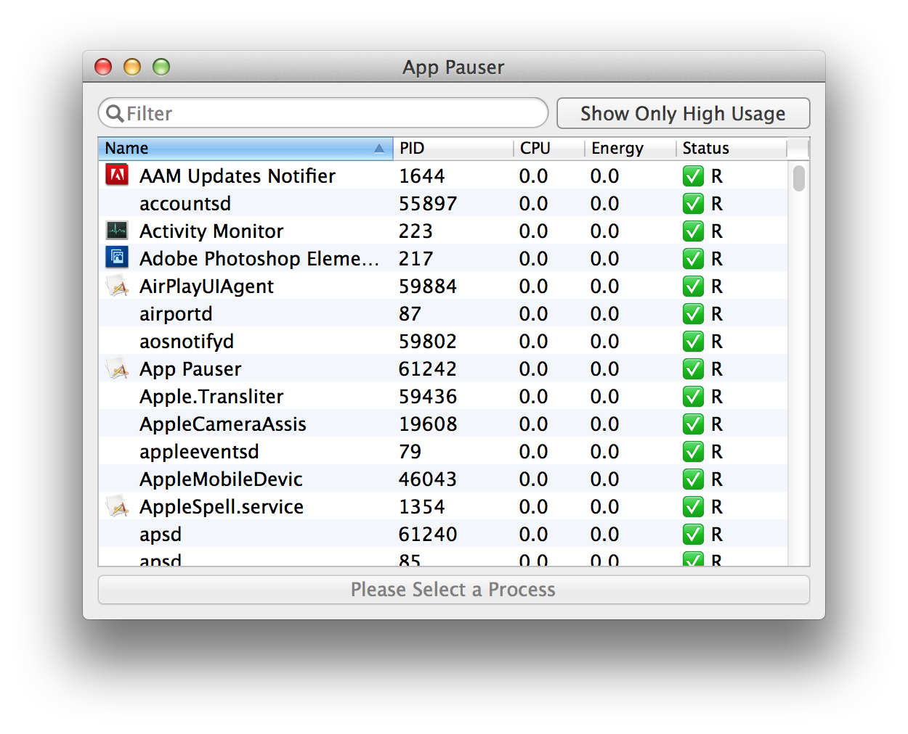

# App Pauser

This is a simple app that allows you to suspend and resume applications and processes running on your system by sending them `kill -STOP` and `kill -CONT`. When an application is in a suspended state, it still uses up memory, but its CPU cycles drop down to zero. I find this very convenient when I have a million tabs open in a browser and I want to save battery life while I'm traveling.

The app is in a rough state and there are no safety checks, but it does work. Development is currently on hiatus.

</img>